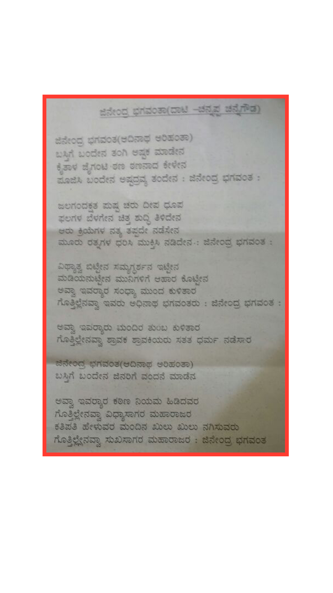

# ಜಿನೇಂದ್ರ ಭಗವಂತ । ಆದಿನಾಥ ಅರಿಹಂತ ।। जिनेंद्र भगवंत । आदिनाथ अरिहंत ।। Jinendra Bhagawanta । Aadinatha Arihanta ।।

> Table of Contents

<!-- TOC -->

- [ಜಿನೇಂದ್ರ ಭಗವಂತ । ಆದಿನಾಥ ಅರಿಹಂತ ।। जिनेंद्र भगवंत । आदिनाथ अरिहंत ।। Jinendra Bhagawanta । Aadinatha Arihanta ।।](#ಜಿನೇಂದ್ರ-ಭಗವಂತ-।-ಆದಿನಾಥ-ಅರಿಹಂತ-।।-जिनेंद्र-भगवंत-।-आदिनाथ-अरिहंत-।।-jinendra-bhagawanta-।-aadinatha-arihanta-।।)
    - [Video](#video)
    - [ಕನ್ನಡ ( कन्नड़ / Kannada )](#ಕನ್ನಡ--कन्नड़--kannada-)
        - [Another version of the song](#another-version-of-the-song)
    - [हिंदि ( ಹಿಂದಿ / Hindi )](#हिंदि--ಹಿಂದಿ--hindi-)
    - [English ( ಆಂಗ್ಲ )](#english--ಆಂಗ್ಲ-)
        - [Stanza 1/3/5](#stanza-135)
            - [Words Meaning (Stanza 1)/3/5](#words-meaning-stanza-135)
            - [Meaning (Stanza 1/3/5)](#meaning-stanza-135)
        - [Stanza 2 - Part 1](#stanza-2---part-1)
            - [Words Meaning (Stanza 2)](#words-meaning-stanza-2)
            - [Meaning (Stanza 2)](#meaning-stanza-2)
        - [Stanza 4](#stanza-4)
            - [Words Meaning (Stanza 4)](#words-meaning-stanza-4)
            - [Meaning (Stanza 4)](#meaning-stanza-4)

<!-- /TOC -->

## Video

[
    ೯೪ ವರುಷದ ಮುನಿ ಸಂಯಮಸಾಗರ ರವರ ಮದುರ ಧ್ವನಿಯಿಂದ:  
    मुनि संयमसागर जी की मधुर आवाज़ में:  
    94 years old Muni Sayamasagara's beautiful voice:  
](https://www.facebook.com/AcharyaVidyasagarJi/videos/1694386503936795/?hc_ref=NEWSFEED)

## ಕನ್ನಡ ( कन्नड़ / Kannada )

> _ಪ್ರತಿ ಸಾಲನ್ನು ಎರಡು ಸಲ ಹೇಳಿ_

```
ಜಿನೇಂದ್ರ ಭಗವಂತ । ಆದಿನಾಥ ಅರಿಹಂತ ।।  
ಬಸದಿಗೆ ಬಂದೇನೇ । ಜಿನರಿಗೆ ವಂದನೆ ಮಾಡೇನೇ ।।
```

```
ಮಿಥ್ಯಾತ್ವ ಬಿಟ್ಟೇನೆ । ಸಮ್ಯಕ್ ದರ್ಶನ ಧರಿಸೇನೆ ।।  
ಮಡಿಯ ಉಟ್ಟೇನೇ । ಮುನಿಗಳಿಗೆ ಆಹಾರ ಕೊಟ್ಟೇನೆ ।।
```

```
ಜಿನೇಂದ್ರ ಭಗವಂತ । ಆದಿನಾಥ ಅರಿಹಂತ ।।  
ಬಸ್ದಿಗೆ ಬಂದೇನೇ । ಜಿನ ಪೂಜೆಯ ಮಾಡೇನೇ ।।
```

```
ಆರು ಕ್ರಿಯೆಗಳ । ನಿತ್ಯ ತಪ್ಪನೆ ಮಾಡನೇ ।।  
ಮೂರು ರತ್ನಗಳ ಧರಿಸಿ । ಮುಕ್ತಿಗೆ ಹೋದೆನೇ ।।
```

```
ಜಿನೇಂದ್ರ ಭಗವಂತ । ಆದಿನಾಥ ಅರಿಹಂತ ।।  
ಬಸ್ದಿಗೆ ಬಂದೇನೇ । ಜಿನ ಭಜನೆಯ ಮಾಡೇನೇ ।।
```

### Another version of the song



---

## हिंदि ( ಹಿಂದಿ / Hindi )

> 1. Read like Sanskrit.  
    _कन्नड (not कन्नड्) pronunciation is more like संस्कृत्_.
> 1. _Repeat each line twice_

```
जिनेन्द्र भगवंत । आदिनाथ अरिहंत ।।  
बसदिगे बन्देने । जिनरिगे वंदने माडेने ।।
```

```
मित्यत्व बिट्टेने । सम्यक दर्शन दरिसेने ।।  
मडीय उट्टेने । मुनिगलिगे आहार कोट्टेने ।।
```

```
जिनेन्द्र भगवंत । आदिनाथ अरिहंत ।।  
बसदिगे बन्देने । जिन पूजेय माडेने ।।
```

```
आरु क्रियेगल । नित्य तप्पने मादेने ।।  
मुरू रत्नगला धरिसि । मुक्तिगे होदेने ।।
```

```
जिनेन्द्र भगवंत । आदिनाथ अरिहंत ।।  
बसदिगे बन्देने । जिन भजनेय माडेने ।।
```

---

## English ( ಆಂಗ್ಲ )

### Stanza 1/3/5

```
Jinendra Bhagawanta । Aadinatha Arihanta ।।  ||Pa|| (1st/3rd/5th stanza 1st line - repeat twice)

Basadige bandene । jina vandane maadene ।।  (1st stanza last line - repeat twice)

Basadige bandene । jina poojeya maadene ।।  (3rd stanza last line - repeat twice)

Basadige bandene । jina bhajaneya maadene ।। (5th stanza last line - repeat twice)
```

#### Words Meaning (Stanza 1)/3/5

Jinendra = Jina + Indra i.e., king of jinas => [Tirthankara](https://en.wikipedia.org/wiki/Tirthankara); Bhagawan = God; [Aadinatha](https://en.wikipedia.org/wiki/Rishabhanatha) = First Tirthankara; [Arihanta](https://en.wikipedia.org/wiki/Arihant_%28Jainism%29) = Sould who has conquered all inner karmas)  

[Basadi](https://en.wikipedia.org/wiki/Jain_temple) = Jain Temple; Ge = To; Bandena = Came; Vandane = Bow; Madena = To do )  

#### Meaning (Stanza 1/3/5)

Jinendra Bhagawanta | Aadinatha Arihanta ||  
Coming to Jain Temple । Bowing to Jina ।।

### Stanza 2 - Part 1

```
Mityatva Bittene । Samyak Darshana Dharisene ।।  
Mityatva Bittene । Samyak Darshana Dharisene ।।  
Madiya uttene । Munigalige aahara kottene ।।  
Madiya uttene । Munigalige aahara kottene ।। Jinendra Bhagawanta...  
```

#### Words Meaning (Stanza 2)

Mityatva = False; Bittene = Leave; Samyak = Right; Darshana = Perception; Dharisene = Wear  

Madiya = Clean washed clothes which are mainly used for doing puja/abhisheka; Uttena = Wore; [Muni](https://en.wikipedia.org/wiki/Digambara_monk) = Digambara Monk; Munigalu = Digambara Monks; Ge = To; Munigalige = To Digambara Monks; Aahara = Food; Kottene = Gave   

#### Meaning (Stanza 2)

Leaving the false perception । Wearing (adapting) the right perception ।।  
Wearing clean clothes । Giving food to muni ।।

### Stanza 4

```
Aaru kriyegala । Nitya tappane maadene ।।  
Aaru kriyegala । Nitya tappane maadene ।।  
Muruu ratnagala dharisi । Muktige hodene ।।  
Muruu ratnagala dharisi । Muktige hodene ।। Jinendra Bhagawanta...  
```

#### Words Meaning (Stanza 4)

Aaru = 6; Kriye = action; Kriyegalu = actions; Nitya = Everyday; tappane = Without missing; Maadene = Do 

Muruu = 3; Ratna = Jewel; Ratnagala = Jewels; Dharisi = Wear; Mukti = Liberation; Ge = To; Muktige = To Liberation; Hodene = Go/went)  

#### Meaning (Stanza 4)

Doing 6 actions everyday without missing them।। 
_6 jain shravak actions - Deva pooja, Guru seva, Swadhyaya, Samyama, Tapa, Dana_

Wearing 3 jewels। heading towards liberation ।।  
*3 jewels of jainism - Samyak Darshan, Samyak Jnaan, Samyak Charitra)*  

---
